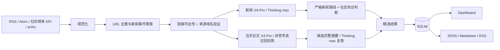

# Daily AI Radar

一个可解释、可本地运行的每日情报项目：

1. 聚合重大 AI 基座模型、重要工具/硬件、自动驾驶数据集与 Benchmark、重要且热议的科研成果，以及有可验证互动量的社区热议，并将同一事件的多个来源折叠到一起。
2. 收集最新 MLLM/VLM/VLA 论文，但主 Feed 只接受同时以多模态模型和自动驾驶应用为实质核心的论文。

当前版本是 **v0.8.0 早间准时交付版**。程序负责来源真实性、时间窗口、社区互动量、去重和 arXiv 身份校验。新闻与论文严格复筛使用 `deepseek-v4-pro` 的 Thinking `max`；当天论文的全量初筛使用同一个 V4-Pro 的非思考模式降低 Token 消耗。关键词分数不再决定正式 Feed，模型也不能凭空声明某条内容“很热”。

## v0.8.0 已包含

- 16 个启用来源，包括官方博客、媒体、GitHub Releases、Hacker News 官方 API 与掘金人工智能热榜；Anthropic 和 CSDN 候选源因当前无法稳定核验发布时间而保留为禁用状态。
- arXiv `cs.CV/cs.RO/cs.AI/cs.LG/cs.CL/cs.SY/eess.SY/eess.IV/stat.ML` 当天公告批次全量采集：按官方美东公告计划解析对应提交区间，自动分页到 `totalResults` 末尾，不再截断为 150 条。
- URL 规范化、精确去重和相似标题事件聚类。
- 新闻方向不限，但模型发布只收重大基座模型；数据集/Benchmark 只收自动驾驶；科研成果必须同时重要且具有采集器验证的社区热度。
- 独立的“社区热议”类别，当前使用 Hacker News 积分/评论与掘金 AI 热榜的热度/浏览/点赞/评论/收藏；页面明确提示这些指标是讨论信号，不是一手事实证明。
- 社区热度由结构化互动量和配置门槛确定，DeepSeek 只能解释这些信号，不能从标题语气或自身记忆猜测热度。
- arXiv 查询不再预先要求 MLLM/VLA/驾驶关键词；当天所有已验证论文先由 V4-Pro 做高召回语义初筛，入围项再以完整摘要执行 Thinking `max` 严格复筛。
- 分别保存 arXiv 首次发布时间、最后更新时间和版本号；每日入口只处理首次发布时间位于当天的论文，不把旧论文版本更新伪装成今日新论文。
- 固定使用 `deepseek-v4-pro`；新闻与论文严格复筛开启 Thinking `max`，论文高召回初筛关闭 Thinking，不自动降级到 Flash 或硬编码评分。
- 新闻、论文初筛、论文复筛和系统 Prompt 独立存放在 `prompts/`，每条判断记录 Prompt 版本与 SHA-256。
- 每次 API 调用记录输入、输出、推理、缓存 Token 与估算费用，并按新闻、论文初筛、论文复筛展示阶段用量；每日 50 万 Token / 1 美元双限额。
- GitHub Pages 显示当日 DeepSeek 用量；同一天重复运行会从 Pages 与 Actions 当日状态缓存恢复累计量，失败调用也不会在下一次运行中丢失。
- V4-Pro 最大思考使用 32,768 输出 Token 上限；若仍返回 `finish_reason=length`，程序会自动拆小候选批次，不会原样重复同一个截断请求。
- 163 SMTP 定时邮件；同一个邮箱可同时作为发件和收件账号。
- SQLite 历史库、收藏/已读/不相关反馈。
- FastAPI Dashboard，以及 JSON、Markdown、RSS 导出。
- 可直接发布的 GitHub Pages 静态站点，支持内容类型、精选范围、论文日期和全文搜索切换。
- Cloudflare Worker 在 07:15–07:55 准时触发新闻预筛，并从 08:05 起按美东夏/冬令时自动等待 arXiv 当天公告，再触发论文筛选、Pages 和邮件；目标是在北京时间 10:00 前完成。
- 发布阶段复用当天已完成的新闻状态；若邮件或 Pages 失败，后续重试也复用已完成的新闻/论文结果，避免重复消耗 Token。
- GitHub Actions 自带的 08:10、08:30、08:50、09:10、09:30 定时继续作为独立兜底；首次完整成功后，其余触发按当日成功标记直接退出。
- 逐条 URL 可达性检查、发布域名白名单和 arXiv ID 一致性校验。
- 逐来源健康记录：Feed 原始 URL、最终 URL、HTTP 状态、条目数、耗时和错误。
- 真实数据库与演示数据库物理隔离；正式导出只包含已验证结果。
- 采集运行记录额外保存“当日查询、来源验证、初筛候选、初筛淘汰、严格复筛、最终入选”数量，出现 0 条时可以定位具体阶段。
- 论文页默认严格显示北京时间当天，另提供“近 4 日”和“历史”视图，不用旧论文填充今日空缺。
- 离线演示数据和单元测试。

## 5 分钟启动

当前项目兼容 Python 3.9+。

```bash
cd /Users/fangzekuan/Desktop/Daily_Paper
python3 -m venv .venv
source .venv/bin/activate
python -m pip install --upgrade pip setuptools wheel
python -m pip install -e .

export DEEPSEEK_API_KEY="你的 DeepSeek API Key"
daily-radar init
daily-radar collect --kind all
daily-radar serve
```

打开 <http://127.0.0.1:8000>。默认主库不包含任何演示条目。

运行真实采集：

```bash
daily-radar collect --kind all
daily-radar export
daily-radar build-site --output site
```

重新审计已经保存的链接和来源域名：

```bash
daily-radar verify --kind all
```

演示数据默认写入独立的 `data/demo_radar.db`，不会进入真实 Dashboard、统计或导出：

```bash
daily-radar seed-demo
DAILY_RADAR_DB=data/demo_radar.db daily-radar serve --port 8001
```

如果只想运行其中一个管线：

```bash
daily-radar collect --kind news
daily-radar collect --kind paper
```

查看数据库状态：

```bash
daily-radar status
```

## 工作流



DeepSeek 是正式 Feed 的唯一语义裁判。论文初筛只在能明确排除至少一个目标方向时拒绝，不确定项必须进入严格复筛。Key 缺失、模型配置被降级、响应字段不完整、预算耗尽或 API 调用失败时，任务会停止，不会发布只完成一部分筛选的日报，也不会静默回退到关键词评分；上一版已成功部署的 Pages 会继续保留。

## 配置

- [`config/settings.yaml`](config/settings.yaml)：时间窗口、arXiv 分类、DeepSeek、预算、Prompt 路径和 SMTP 主机设置。
- [`config/sources.yaml`](config/sources.yaml)：新闻来源、采集适配器、来源等级和社区热度门槛。
- [`docs/COMMUNITY_SOURCES.md`](docs/COMMUNITY_SOURCES.md)：社区来源能力、真实性边界及知乎/公众号未直接启用的原因。
- [`prompts/news_screening.md`](prompts/news_screening.md)：新闻筛选 Prompt。
- [`prompts/paper_triage.md`](prompts/paper_triage.md)：当天全量论文高召回初筛 Prompt。
- [`prompts/paper_screening.md`](prompts/paper_screening.md)：论文筛选 Prompt。
- [`prompts/system.md`](prompts/system.md)：共同的安全与事实边界 Prompt。
- [`prompts/README.md`](prompts/README.md)：后续修改、验证和升级 Prompt 的步骤。
- [`.env.example`](.env.example)：秘密和运行时环境变量示例。

来源等级：

- `tier: 1`：官方博客、研究机构、项目 Release 等一手源。
- `tier: 2`：有编辑流程的媒体或技术博客。
- `tier: 3`：社区和发现渠道；可以提供热度信号，但不能压过一手来源。

任何单个 Feed 失败都不会中断整个任务，失败会写入 `source_checks` 和 `runs` 表，并显示在 Dashboard 的“来源健康与采集凭据”区域。

每个来源在 `sources.yaml` 中都有显式 `allowed_domains`。普通官方/媒体来源的文章域名不匹配时，不进入默认页面；社区发现源可以链接到外部网站，但会明确显示为“外链可访问”，不会伪装成一手来源。

### DeepSeek 与 Prompt

复制 `.env.example` 中需要的值到当前 shell 或 `.env` 管理工具：

```bash
export DEEPSEEK_API_KEY="your-key"
```

项目调用 DeepSeek OpenAI-compatible `/chat/completions`，请求固定包含 `model=deepseek-v4-pro`、`thinking.enabled`、`reasoning_effort=max` 和 JSON Output。项目不会自动读取 `.env`，可使用 shell、direnv 或 GitHub Actions Secrets 注入。

模型名、Thinking 参数和峰谷价格均以 DeepSeek 官方文档为依据：[Models & Pricing](https://api-docs.deepseek.com/quick_start/pricing/)、[Thinking Mode](https://api-docs.deepseek.com/guides/thinking_mode/)、[Chat Completions API](https://api-docs.deepseek.com/api/create-chat-completion/)。

修改筛选标准时直接编辑 `prompts/news_screening.md`、`prompts/paper_triage.md` 或 `prompts/paper_screening.md`，保留 `{{schema_json}}` 与 `{{candidates_json}}` 两个占位符，然后同步递增 `config/settings.yaml` 中的 `prompt_version`。代码仍会严格校验候选 ID、布尔门槛、分类和各维度分数，避免 Prompt 改动破坏数据结构。

修改后可先做完全离线的检查，不会消耗 Token：

```bash
daily-radar validate-prompts
python -m unittest discover -s tests -v
```

## 筛选逻辑

### 新闻

程序先验证来源、发布时间及可用的社区互动量，再让 DeepSeek 根据完整候选判断：

```text
新闻主 Feed = 重大基座模型发布
              OR 重要 AI 产品/工具/硬件发布
              OR 自动驾驶数据集/Benchmark 发布
              OR 同时重要且有可验证热度的科研成果
              OR 有可验证热度且具实质价值的社区讨论
```

小型任务模型和例行模型更新、非自动驾驶数据集/Benchmark、没有合格热度信号的科研成果，以及观点评论、教程、旧闻、传闻、融资并购、司法监管和 Sponsored/付费软文不进入主 Feed。最终语义判断来自 DeepSeek；`has_verifiable_heat_signal` 会由程序再次与采集器指标核对，模型无法伪造。社区原帖只能作为 `community-trending` 入选，不能直接充当模型、产品或科研成果正式发布的一手证明。

同一事件合并时，页面优先展示等级更高的一手来源，并只在“同一事件”区域保留通过验证的其他报道链接。

### 论文

程序先根据 arXiv 美东时间 20:00 的[官方公告计划](https://info.arxiv.org/help/availability.html)计算当天公告对应的提交区间，再构造 `submittedDate` 查询；只限制配置中的高相关分类，不加入任何 MLLM/VLA/驾驶关键词。随后使用 `start` 与 `max_results` 分页读取 `totalResults` 指定的全部结果，页间默认等待 3 秒。分页规则、GMT 日期格式与版本字段来自 [arXiv API User's Manual](https://info.arxiv.org/help/api/user-manual.html)。

每篇通过 arXiv 身份验证的新论文都会经历两个阶段：

1. V4-Pro 非思考高召回初筛：输入标题、分类和摘要前 480 字；无法明确排除时继续复筛。
2. V4-Pro Thinking `max` 严格复筛：输入完整公开摘要并执行以下三重门槛。

```text
主 Feed = MLLM/VLM/VLA 是方法实质核心
          AND 自动驾驶是实质应用/实验对象
          AND 并非只在背景或相关工作中顺带提及
```

严格复筛返回两个方向的语义相关性、方法新颖性、证据质量、可复现性和总体重要性。程序只验证结构并按模型给出的总体重要性排序，不再用固定加权公式决定入选。

每篇论文还必须满足：arXiv API 返回的 ID 与 `arxiv.org/abs/{id}` 官方摘要页一致。页面直接显示 arXiv ID、摘要页、PDF 和可用的 DOI/代码链接。

“今日论文”按公告批次转换后的 `Asia/Shanghai` 日期判断，而不是错误地要求作者首次提交时间也落在北京时间当天。页面同时保留并展示官方首次提交时间；`updated` 与版本号用于区分后续版本，旧论文更新不会进入当日候选。SQLite 中已有的旧结果仍可出现在“近 4 日”或“历史”视图；如果今天没有通过三重门槛的论文，页面明确显示 0 条。

默认 50 万 Token / 1 美元预算用于降低高论文量日的 Token 上限失败概率。若当天分类论文较多而预算不足，工作流会在发布与发信前失败，保留上一版 Pages；可通过 `DAILY_RADAR_LLM_DAILY_TOKEN_LIMIT` 和 `DAILY_RADAR_LLM_DAILY_COST_LIMIT_USD` 继续调整上限，页面会按阶段记录实际用量。

### “真实性”的技术边界

当前版本能确认：

- Feed/API 本身是否成功访问。
- 条目是否具有合法且可访问的 HTTP(S) 原始链接。
- 最终跳转域名是否匹配配置的官方或媒体域名。
- 论文 arXiv ID 是否与官方记录一致。
- Feed/arXiv 是否提供可解析的原始发布时间；缺失、格式无效或异常未来时间不会进入当期结果。
- 同一新闻是否存在多个已验证来源。
- Hacker News / 掘金是否确实给出达到配置门槛的榜单排名或互动量。

这些检查保证来源与热度可追溯，并不能自动证明报道或社区帖子中的每个事实都正确。事实层真实性仍需要一手公告、多源交叉印证或人工复核；系统不会把单个社区帖子标记为“官方已证实”。

详细设计和下一阶段候选见 [`docs/ROADMAP.md`](docs/ROADMAP.md)。

## GitHub Pages 自动部署

自动部署包含在 [`.github/workflows/pages.yml`](.github/workflows/pages.yml)。仓库需要：

- Actions Secret `DEEPSEEK_API_KEY`：已设置；
- Repository variable `ARXIV_CONTACT_EMAIL`：只用于合规 User-Agent；
- Actions Secret `DAILY_RADAR_EMAIL_USERNAME`：163 邮箱地址；
- Actions Secret `DAILY_RADAR_EMAIL_AUTH_CODE`：163 客户端授权码，不是登录密码。

要解决 GitHub 定时可能延迟数小时的问题，还需部署 [`cloudflare-worker/`](cloudflare-worker/) 中的外部触发器，并把仅限本仓库、具有 Actions 读写权限的 GitHub fine-grained token 保存为 Cloudflare Secret `GITHUB_ACTIONS_TOKEN`。该 Token 不进入 GitHub 仓库。

收件地址默认等于发件账号，不需要再设置第二个邮箱。自动日报把邮件发送视为完整成功的一部分：两个邮件 Secret 缺失或 SMTP 发送失败时不会写入当日成功标记，后续备用时间会继续重试，并保留上一版成功的 Pages。

完整的 Pages/邮件设置见 [`docs/GITHUB_PAGES.md`](docs/GITHUB_PAGES.md)，10 点前交付所需的 Cloudflare 设置见 [`docs/CLOUDFLARE_DISPATCHER.md`](docs/CLOUDFLARE_DISPATCHER.md)。

## 命令与 API

```text
daily-radar init
daily-radar seed-demo
daily-radar purge-demo
daily-radar collect --kind news|paper|all|publish
daily-radar verify --kind news|paper|all
daily-radar export  # 新闻近 48 小时，论文仅北京时间当天
daily-radar export --paper-period recent
daily-radar export --paper-period all
daily-radar build-site --output site
daily-radar send-email --site-url https://allthingsone.github.io/daily-ai-radar/
daily-radar restore-usage --url https://allthingsone.github.io/daily-ai-radar/data/latest.json
daily-radar validate-prompts
daily-radar status
daily-radar serve --host 127.0.0.1 --port 8000
```

HTTP API：

- `GET /health`
- `GET /api/items?kind=news&important=true&period=recent`
- `GET /api/items?kind=paper&important=true&period=today`
- `GET /api/runs`
- `GET /api/sources`
- `GET /api/llm-usage`
- `POST /api/items/{id}/feedback`，JSON 为 `{"value":"saved|read|not_relevant"}`

## 测试

```bash
PYTHONPYCACHEPREFIX=/tmp/daily-radar-pycache \
  python -m unittest discover -s tests -v
```

## 数据与合规

- arXiv 元数据只通过其公开 API 获取，并校验 ID 与官方摘要页；定时部署前请在 `user_agent` 中换成真实联系邮箱。
- 项目默认保存论文摘要页和 PDF 链接，不重新托管论文 PDF。
- RSS 正文仅保存 Feed 已公开提供的摘要；社区采集只读取公开榜单、原帖元数据和互动计数，不绕过登录、付费墙或访问控制。
- API Key 不写入数据库、导出文件或日志。
- 邮箱地址和 SMTP 授权码不写入仓库或页面；Actions 日志不打印收件地址。
- DeepSeek 只接收来源公开提供的标题、摘要、发布日期和来源标签，不接收邮箱配置。
- `outputs/` 只导出通过来源验证或被发布站点限制自动访问的条目；无来源、域名不匹配和演示数据不导出。默认每日导出不会用往日论文填充当天结果。

## 项目结构

```text
config/                     来源、DeepSeek、预算与邮件主机配置
prompts/                    可直接修改和版本化的筛选 Prompt
src/daily_radar/
  collectors/              RSS/Atom 与 arXiv 采集器
  processing/              规范化、去重与新闻事件聚类
  web/                      FastAPI Dashboard
  llm.py                    DeepSeek 筛选、JSON 校验与预算控制
  mailer.py                 163 SMTP 日报
  static_site.py            GitHub Pages 静态站点生成器
  db.py                     SQLite 数据层
  pipeline.py               任务编排
  exporter.py               JSON/Markdown/RSS 导出
tests/                      离线单元测试
data/                       本地数据库（默认不提交）
outputs/                    导出结果（默认不提交）
site/                       本地 Pages 构建结果（默认不提交）
cloudflare-worker/          准时检查并触发 GitHub Actions 的外部闹钟
.github/workflows/pages.yml 每日采集与 GitHub Pages 发布
```
