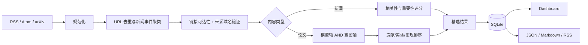

# Daily AI Radar

一个可解释、可本地运行的每日情报项目：

1. 聚合全 AI 领域的新模型、新工具、新数据集与技术成果，并将同一事件的多个来源折叠到一起。
2. 收集最新 MLLM/VLM/VLA 论文，但主 Feed 只接受同时命中“多模态模型轴”和“自动驾驶应用轴”的论文。

当前版本是 **v0.4.0 GitHub Pages 预览版**。核心采集、来源验证与评分不需要 LLM Key；配置 LLM 后，只对精选结果做中文摘要增强，不改变确定性筛选结果。

## v0.4.0 已包含

- 15 个启用的 RSS/Atom 来源，包括官方博客、媒体、HN 发现源和 GitHub Releases；Anthropic 候选源因目前没有官方 RSS 而保留为禁用状态。
- arXiv `cs.CV/cs.RO/cs.AI/cs.LG/cs.CL` 最新论文采集。
- URL 规范化、精确去重和相似标题事件聚类。
- 新闻 8 维评分与逐项解释。
- 新闻不限制自动驾驶或多模态方向，但必须通过“具体发布或技术成果”硬门槛。
- MLLM/VLA × 自动驾驶双轴硬门槛和论文 7 维评分。
- SQLite 历史库、收藏/已读/不相关反馈。
- FastAPI Dashboard，以及 JSON、Markdown、RSS 导出。
- 可直接发布的 GitHub Pages 静态站点，支持内容类型、精选范围、论文日期和全文搜索切换。
- GitHub Actions 每天北京时间 08:37 自动采集、测试、构建并发布；本地电脑无需在线。
- 逐条 URL 可达性检查、发布域名白名单和 arXiv ID 一致性校验。
- 逐来源健康记录：Feed 原始 URL、最终 URL、HTTP 状态、条目数、耗时和错误。
- 真实数据库与演示数据库物理隔离；正式导出只包含已验证结果。
- 论文页默认严格显示北京时间当天，另提供“近 4 日”和“历史”视图，不用旧论文填充今日空缺。
- 离线演示数据和单元测试。

## 5 分钟启动

当前项目兼容 Python 3.9+。

```bash
cd /Users/fangzekuan/Desktop/Daily_Paper
python3 -m venv .venv
source .venv/bin/activate
python -m pip install --upgrade pip setuptools wheel
python -m pip install -e .

daily-radar init
daily-radar collect --kind all
daily-radar serve
```

打开 <http://127.0.0.1:8000>。默认主库不包含任何演示条目。

运行真实采集：

```bash
daily-radar collect --kind all
daily-radar export
daily-radar build-site --output site
```

重新审计已经保存的链接和来源域名：

```bash
daily-radar verify --kind all
```

演示数据默认写入独立的 `data/demo_radar.db`，不会进入真实 Dashboard、统计或导出：

```bash
daily-radar seed-demo
DAILY_RADAR_DB=data/demo_radar.db daily-radar serve --port 8001
```

如果只想运行其中一个管线：

```bash
daily-radar collect --kind news
daily-radar collect --kind paper
```

查看数据库状态：

```bash
daily-radar status
```

## 工作流



评分发生在 LLM 摘要之前。即使第三方模型不可用，采集、入选、排序、数据库和页面仍正常工作。

## 配置

- [`config/settings.yaml`](config/settings.yaml)：时间窗口、阈值、个性化关键词、arXiv 分类、网络和 LLM 设置。
- [`config/sources.yaml`](config/sources.yaml)：新闻来源、来源等级、类型和主题聚焦度。
- [`.env.example`](.env.example)：可选环境变量。

来源等级：

- `tier: 1`：官方博客、研究机构、项目 Release 等一手源。
- `tier: 2`：有编辑流程的媒体或技术博客。
- `tier: 3`：社区和发现渠道；可以提供热度信号，但不能压过一手来源。

任何单个 Feed 失败都不会中断整个任务，失败会写入 `source_checks` 和 `runs` 表，并显示在 Dashboard 的“来源健康与采集凭据”区域。

每个来源在 `sources.yaml` 中都有显式 `allowed_domains`。普通官方/媒体来源的文章域名不匹配时，不进入默认页面；社区发现源可以链接到外部网站，但会明确显示为“外链可访问”，不会伪装成一手来源。

### 可选 LLM 中文增强

复制 `.env.example` 中需要的值到当前 shell 或 `.env` 管理工具：

```bash
export DAILY_RADAR_LLM_ENABLED=true
export DAILY_RADAR_LLM_BASE_URL=https://api.openai.com/v1
export DAILY_RADAR_LLM_API_KEY=your-key
export DAILY_RADAR_LLM_MODEL=your-model
```

适配器使用常见的 OpenAI-compatible `/chat/completions` 接口。项目不会从 `.env` 自动读取文件，以免在未审阅的环境里隐式加载秘密；可使用你已有的 shell、direnv 或部署平台管理环境变量。

采集到的网页文本被明确作为不可信数据放入提示词，要求模型不得执行其中指令。LLM 失败只会记录警告，不会删除或改变规则结果。

## 筛选逻辑

### 新闻

新闻总分由以下项组成：AI 相关性 25、影响力 25、来源 15、新鲜度 10、多源佐证 10、社区热度 10、个人偏好 5，并对营销型措辞最多扣 20 分。

分数之前先执行不可绕过的事件门槛：

```text
发布事件 = 发布/上线/开源等动作 AND 模型/API/框架/数据集/硬件等具体载体
成果事件 = 发现/验证/突破/领先等动作 AND 研究/实验/基准/原型等结果证据
新闻主 Feed = AI 主题 AND (发布事件 OR 成果事件)
```

自动驾驶、多模态、Agent 和开源等关键词只影响偏好分，不限制新闻主题。观点评论、融资并购、司法监管、泛使用讨论以及 Sponsored/付费软文默认不进入主 Feed。媒体与社区文章还要求关键事件信号出现在标题中，避免因长文回顾历史模型或旧论文而误判为今日新成果。

同一事件合并时，页面优先展示等级更高的一手来源，并只在“同一事件”区域保留通过验证的其他报道链接。

### 论文

先执行不可绕过的双轴门槛：

```text
模型轴：MLLM / VLM / VLA / vision-language / multimodal reasoning
驾驶轴：autonomous driving / driving agent / trajectory / CARLA / NAVSIM / ...

主 Feed = 模型轴 AND 驾驶轴
```

通过后再按领域相关性 35、方法贡献 20、实验依据 15、可复现性 10、新鲜度 10、社区信号 5、个人偏好 5 排序。机构名称和引用数不参与硬过滤。

每篇论文还必须满足：arXiv API 返回的 ID 与 `arxiv.org/abs/{id}` 官方摘要页一致。页面直接显示 arXiv ID、摘要页、PDF 和可用的 DOI/代码链接。

“今日论文”按 `Asia/Shanghai` 自然日判断，并使用论文的官方首次提交时间。采集器保留 96 小时回补窗口，以应对 arXiv 周末节奏或临时采集中断，但旧论文只会出现在“近 4 日”或“历史”视图；如果今天没有通过双轴门槛的论文，页面明确显示 0 条。

### “真实性”的技术边界

v0.2 能确认：

- Feed/API 本身是否成功访问。
- 条目是否具有合法且可访问的 HTTP(S) 原始链接。
- 最终跳转域名是否匹配配置的官方或媒体域名。
- 论文 arXiv ID 是否与官方记录一致。
- 同一新闻是否存在多个已验证来源。

这些检查保证来源可追溯，并不能自动证明报道中的每个事实都正确。事实层真实性仍需要一手公告、多源交叉印证或人工复核；系统不会把单个社区帖子标记为“官方已证实”。

详细设计和下一阶段候选见 [`docs/ROADMAP.md`](docs/ROADMAP.md)。

## GitHub Pages 自动部署

第一版已经包含 [`.github/workflows/pages.yml`](.github/workflows/pages.yml)。你只需准备 GitHub 账号、公开仓库，并设置一个 `ARXIV_CONTACT_EMAIL` 仓库变量；不需要提供密码、Token、新闻 API Key 或 LLM Key。

完整的首次启用步骤、每天如何更新、失败时如何保留旧页面以及当前限制，见 [`docs/GITHUB_PAGES.md`](docs/GITHUB_PAGES.md)。

## 命令与 API

```text
daily-radar init
daily-radar seed-demo
daily-radar purge-demo
daily-radar collect --kind news|paper|all
daily-radar verify --kind news|paper|all
daily-radar export  # 新闻近 48 小时，论文仅北京时间当天
daily-radar export --paper-period recent
daily-radar export --paper-period all
daily-radar build-site --output site
daily-radar status
daily-radar serve --host 127.0.0.1 --port 8000
```

HTTP API：

- `GET /health`
- `GET /api/items?kind=news&important=true&period=recent`
- `GET /api/items?kind=paper&important=true&period=today`
- `GET /api/runs`
- `GET /api/sources`
- `POST /api/items/{id}/feedback`，JSON 为 `{"value":"saved|read|not_relevant"}`

## 测试

```bash
PYTHONPYCACHEPREFIX=/tmp/daily-radar-pycache \
  python -m unittest discover -s tests -v
```

## 数据与合规

- arXiv 元数据只通过其公开 API 获取，并校验 ID 与官方摘要页；定时部署前请在 `user_agent` 中换成真实联系邮箱。
- 项目默认保存论文摘要页和 PDF 链接，不重新托管论文 PDF。
- RSS 正文仅保存 Feed 已公开提供的摘要，不绕过登录、付费墙或 robots 限制。
- API Key 不写入数据库、导出文件或日志。
- `outputs/` 只导出通过来源验证或被发布站点限制自动访问的条目；无来源、域名不匹配和演示数据不导出。默认每日导出不会用往日论文填充当天结果。

## 项目结构

```text
config/                     来源与评分配置
src/daily_radar/
  collectors/              RSS/Atom 与 arXiv 采集器
  processing/              规范化、聚类、双轴门槛、评分
  web/                      FastAPI Dashboard
  static_site.py            GitHub Pages 静态站点生成器
  db.py                     SQLite 数据层
  pipeline.py               任务编排
  exporter.py               JSON/Markdown/RSS 导出
tests/                      离线单元测试
data/                       本地数据库（默认不提交）
outputs/                    导出结果（默认不提交）
site/                       本地 Pages 构建结果（默认不提交）
.github/workflows/pages.yml 每日采集与 GitHub Pages 发布
```
