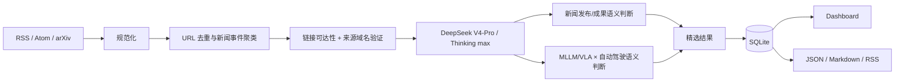

# Daily AI Radar

一个可解释、可本地运行的每日情报项目：

1. 聚合全 AI 领域的新模型、新工具、新数据集与技术成果，并将同一事件的多个来源折叠到一起。
2. 收集最新 MLLM/VLM/VLA 论文，但主 Feed 只接受同时以多模态模型和自动驾驶应用为实质核心的论文。

当前版本是 **v0.5.0 DeepSeek 语义筛选版**。程序负责来源真实性、时间窗口、去重和 arXiv 身份校验；通过这些校验的候选统一交给 `deepseek-v4-pro` 的 Thinking `max` 模式判断是否入选、重要性、分类与中文摘要。关键词分数不再决定正式 Feed。

## v0.5.0 已包含

- 15 个启用的 RSS/Atom 来源，包括官方博客、媒体、HN 发现源和 GitHub Releases；Anthropic 候选源因目前没有官方 RSS 而保留为禁用状态。
- arXiv `cs.CV/cs.RO/cs.AI/cs.LG/cs.CL` 最新论文采集。
- URL 规范化、精确去重和相似标题事件聚类。
- 新闻不限制自动驾驶或多模态方向，由 DeepSeek 判断是否属于重要的新模型、新工具、新数据集或技术成果。
- 论文由 DeepSeek 判断 MLLM/VLM/VLA 和自动驾驶是否均为实质核心，而不是简单关键词共现。
- 固定使用 `deepseek-v4-pro`、Thinking 开启、`reasoning_effort=max`，不自动降级到 Flash 或硬编码评分。
- 新闻、论文和系统 Prompt 独立存放在 `prompts/`，每条判断记录 Prompt 版本与 SHA-256。
- 每次 API 调用记录输入、输出、推理、缓存 Token 与估算费用；每日 25 万 Token / 1 美元双限额。
- GitHub Pages 显示当日 DeepSeek 用量；同一天重复运行会先从上一版 Pages 恢复累计量。
- 163 SMTP 定时邮件；同一个邮箱可同时作为发件和收件账号。
- SQLite 历史库、收藏/已读/不相关反馈。
- FastAPI Dashboard，以及 JSON、Markdown、RSS 导出。
- 可直接发布的 GitHub Pages 静态站点，支持内容类型、精选范围、论文日期和全文搜索切换。
- GitHub Actions 每天北京时间 08:37 自动采集、测试、构建并发布；本地电脑无需在线。
- 逐条 URL 可达性检查、发布域名白名单和 arXiv ID 一致性校验。
- 逐来源健康记录：Feed 原始 URL、最终 URL、HTTP 状态、条目数、耗时和错误。
- 真实数据库与演示数据库物理隔离；正式导出只包含已验证结果。
- 论文页默认严格显示北京时间当天，另提供“近 4 日”和“历史”视图，不用旧论文填充今日空缺。
- 离线演示数据和单元测试。

## 5 分钟启动

当前项目兼容 Python 3.9+。

```bash
cd /Users/fangzekuan/Desktop/Daily_Paper
python3 -m venv .venv
source .venv/bin/activate
python -m pip install --upgrade pip setuptools wheel
python -m pip install -e .

export DEEPSEEK_API_KEY="你的 DeepSeek API Key"
daily-radar init
daily-radar collect --kind all
daily-radar serve
```

打开 <http://127.0.0.1:8000>。默认主库不包含任何演示条目。

运行真实采集：

```bash
daily-radar collect --kind all
daily-radar export
daily-radar build-site --output site
```

重新审计已经保存的链接和来源域名：

```bash
daily-radar verify --kind all
```

演示数据默认写入独立的 `data/demo_radar.db`，不会进入真实 Dashboard、统计或导出：

```bash
daily-radar seed-demo
DAILY_RADAR_DB=data/demo_radar.db daily-radar serve --port 8001
```

如果只想运行其中一个管线：

```bash
daily-radar collect --kind news
daily-radar collect --kind paper
```

查看数据库状态：

```bash
daily-radar status
```

## 工作流



DeepSeek 是正式 Feed 的唯一语义裁判。Key 缺失、模型配置被降级、响应字段不完整、预算耗尽或 API 调用失败时，任务会停止，不会静默回退到关键词评分并发布结果。上一版已成功部署的 Pages 会继续保留。

## 配置

- [`config/settings.yaml`](config/settings.yaml)：时间窗口、arXiv 分类、DeepSeek、预算、Prompt 路径和 SMTP 主机设置。
- [`config/sources.yaml`](config/sources.yaml)：新闻来源、来源等级、类型和主题聚焦度。
- [`prompts/news_screening.md`](prompts/news_screening.md)：新闻筛选 Prompt。
- [`prompts/paper_screening.md`](prompts/paper_screening.md)：论文筛选 Prompt。
- [`prompts/system.md`](prompts/system.md)：共同的安全与事实边界 Prompt。
- [`prompts/README.md`](prompts/README.md)：后续修改、验证和升级 Prompt 的步骤。
- [`.env.example`](.env.example)：秘密和运行时环境变量示例。

来源等级：

- `tier: 1`：官方博客、研究机构、项目 Release 等一手源。
- `tier: 2`：有编辑流程的媒体或技术博客。
- `tier: 3`：社区和发现渠道；可以提供热度信号，但不能压过一手来源。

任何单个 Feed 失败都不会中断整个任务，失败会写入 `source_checks` 和 `runs` 表，并显示在 Dashboard 的“来源健康与采集凭据”区域。

每个来源在 `sources.yaml` 中都有显式 `allowed_domains`。普通官方/媒体来源的文章域名不匹配时，不进入默认页面；社区发现源可以链接到外部网站，但会明确显示为“外链可访问”，不会伪装成一手来源。

### DeepSeek 与 Prompt

复制 `.env.example` 中需要的值到当前 shell 或 `.env` 管理工具：

```bash
export DEEPSEEK_API_KEY="your-key"
```

项目调用 DeepSeek OpenAI-compatible `/chat/completions`，请求固定包含 `model=deepseek-v4-pro`、`thinking.enabled`、`reasoning_effort=max` 和 JSON Output。项目不会自动读取 `.env`，可使用 shell、direnv 或 GitHub Actions Secrets 注入。

模型名、Thinking 参数和峰谷价格均以 DeepSeek 官方文档为依据：[Models & Pricing](https://api-docs.deepseek.com/quick_start/pricing/)、[Thinking Mode](https://api-docs.deepseek.com/guides/thinking_mode/)、[Chat Completions API](https://api-docs.deepseek.com/api/create-chat-completion/)。

修改筛选标准时直接编辑 `prompts/news_screening.md` 或 `prompts/paper_screening.md`，保留 `{{schema_json}}` 与 `{{candidates_json}}` 两个占位符，然后同步递增 `config/settings.yaml` 中的 `prompt_version`。代码仍会严格校验候选 ID、布尔门槛、分类和各维度分数，避免 Prompt 改动破坏数据结构。

修改后可先做完全离线的检查，不会消耗 Token：

```bash
daily-radar validate-prompts
python -m unittest discover -s tests -v
```

## 筛选逻辑

### 新闻

程序先验证来源和发布时间，再让 DeepSeek 根据整段标题与摘要判断：

```text
新闻主 Feed = 具体且重要的 AI 新发布 OR 有明确依据的新技术/研究成果
```

观点评论、教程、旧闻回顾、传闻、融资并购、司法监管、泛使用讨论以及 Sponsored/付费软文不进入主 Feed。最终 `selected`、重要性 0–100、证据、摘要和分类均来自 DeepSeek 的结构化判断。

同一事件合并时，页面优先展示等级更高的一手来源，并只在“同一事件”区域保留通过验证的其他报道链接。

### 论文

来源和 arXiv 身份验证后执行语义双轴门槛：

```text
主 Feed = MLLM/VLM/VLA 是方法实质核心
          AND 自动驾驶是实质应用/实验对象
          AND 并非只在背景或相关工作中顺带提及
```

模型返回两个方向的语义相关性、方法新颖性、证据质量、可复现性和总体重要性。程序只验证结构并按模型给出的总体重要性排序，不再用固定加权公式决定入选。

每篇论文还必须满足：arXiv API 返回的 ID 与 `arxiv.org/abs/{id}` 官方摘要页一致。页面直接显示 arXiv ID、摘要页、PDF 和可用的 DOI/代码链接。

“今日论文”按 `Asia/Shanghai` 自然日判断，并使用论文的官方首次提交时间。采集器保留 96 小时回补窗口，以应对 arXiv 周末节奏或临时采集中断，但旧论文只会出现在“近 4 日”或“历史”视图；如果今天没有通过双轴门槛的论文，页面明确显示 0 条。

### “真实性”的技术边界

v0.2 能确认：

- Feed/API 本身是否成功访问。
- 条目是否具有合法且可访问的 HTTP(S) 原始链接。
- 最终跳转域名是否匹配配置的官方或媒体域名。
- 论文 arXiv ID 是否与官方记录一致。
- Feed/arXiv 是否提供可解析的原始发布时间；缺失、格式无效或异常未来时间不会进入当期结果。
- 同一新闻是否存在多个已验证来源。

这些检查保证来源可追溯，并不能自动证明报道中的每个事实都正确。事实层真实性仍需要一手公告、多源交叉印证或人工复核；系统不会把单个社区帖子标记为“官方已证实”。

详细设计和下一阶段候选见 [`docs/ROADMAP.md`](docs/ROADMAP.md)。

## GitHub Pages 自动部署

自动部署包含在 [`.github/workflows/pages.yml`](.github/workflows/pages.yml)。仓库需要：

- Actions Secret `DEEPSEEK_API_KEY`：已设置；
- Repository variable `ARXIV_CONTACT_EMAIL`：只用于合规 User-Agent；
- Actions Secret `DAILY_RADAR_EMAIL_USERNAME`：163 邮箱地址；
- Actions Secret `DAILY_RADAR_EMAIL_AUTH_CODE`：163 客户端授权码，不是登录密码。

收件地址默认等于发件账号，不需要再设置第二个邮箱。若暂未配置两个邮件 Secret，Pages 仍正常更新，邮件步骤会明确跳过。

完整的首次启用步骤、每天如何更新、失败时如何保留旧页面以及当前限制，见 [`docs/GITHUB_PAGES.md`](docs/GITHUB_PAGES.md)。

## 命令与 API

```text
daily-radar init
daily-radar seed-demo
daily-radar purge-demo
daily-radar collect --kind news|paper|all
daily-radar verify --kind news|paper|all
daily-radar export  # 新闻近 48 小时，论文仅北京时间当天
daily-radar export --paper-period recent
daily-radar export --paper-period all
daily-radar build-site --output site
daily-radar send-email --site-url https://allthingsone.github.io/daily-ai-radar/
daily-radar restore-usage --url https://allthingsone.github.io/daily-ai-radar/data/latest.json
daily-radar validate-prompts
daily-radar status
daily-radar serve --host 127.0.0.1 --port 8000
```

HTTP API：

- `GET /health`
- `GET /api/items?kind=news&important=true&period=recent`
- `GET /api/items?kind=paper&important=true&period=today`
- `GET /api/runs`
- `GET /api/sources`
- `GET /api/llm-usage`
- `POST /api/items/{id}/feedback`，JSON 为 `{"value":"saved|read|not_relevant"}`

## 测试

```bash
PYTHONPYCACHEPREFIX=/tmp/daily-radar-pycache \
  python -m unittest discover -s tests -v
```

## 数据与合规

- arXiv 元数据只通过其公开 API 获取，并校验 ID 与官方摘要页；定时部署前请在 `user_agent` 中换成真实联系邮箱。
- 项目默认保存论文摘要页和 PDF 链接，不重新托管论文 PDF。
- RSS 正文仅保存 Feed 已公开提供的摘要，不绕过登录、付费墙或 robots 限制。
- API Key 不写入数据库、导出文件或日志。
- 邮箱地址和 SMTP 授权码不写入仓库或页面；Actions 日志不打印收件地址。
- DeepSeek 只接收来源公开提供的标题、摘要、发布日期和来源标签，不接收邮箱配置。
- `outputs/` 只导出通过来源验证或被发布站点限制自动访问的条目；无来源、域名不匹配和演示数据不导出。默认每日导出不会用往日论文填充当天结果。

## 项目结构

```text
config/                     来源、DeepSeek、预算与邮件主机配置
prompts/                    可直接修改和版本化的筛选 Prompt
src/daily_radar/
  collectors/              RSS/Atom 与 arXiv 采集器
  processing/              规范化、去重与新闻事件聚类
  web/                      FastAPI Dashboard
  llm.py                    DeepSeek 筛选、JSON 校验与预算控制
  mailer.py                 163 SMTP 日报
  static_site.py            GitHub Pages 静态站点生成器
  db.py                     SQLite 数据层
  pipeline.py               任务编排
  exporter.py               JSON/Markdown/RSS 导出
tests/                      离线单元测试
data/                       本地数据库（默认不提交）
outputs/                    导出结果（默认不提交）
site/                       本地 Pages 构建结果（默认不提交）
.github/workflows/pages.yml 每日采集与 GitHub Pages 发布
```
